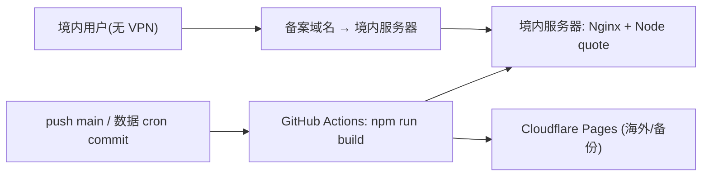

# 境内托管部署方案

## 为什么要这条链路

Cloudflare（`pages.dev` / `workers.dev` / CF anycast）在境内被 GFW 限速/重置：小 HTML/JS 能进，但首屏要拉的 1MB 级数据（`index_bars.csv` 压缩后约 836KB + `barsmore` + `bars`）拉不动，整张表空白；开 VPN 走非限速出口才正常。代码改不动「CF 境内可达性」，唯一治本是把站点放到**境内可达的托管**。

本方案：境内单机（轻量应用服务器）用 Docker 跑 **Nginx（静态 SPA + 数据）+ 一个 Node 实时价服务**，同源承载 UI / 数据 / `/api/quote`，境内无 VPN 可达。Cloudflare 保留为海外/备份，不拆。



## 仓库侧已就绪（阶段0）

| 文件 | 作用 |
|------|------|
| [deploy/nginx.conf](../deploy/nginx.conf) | 静态站 + 同源 `/api` 代理；缓存口径对齐 `public/_headers`；`gzip_types` 显式带 `text/csv`，SPA `try_files` 回退 |
| [deploy/quote-server/server.ts](../deploy/quote-server/server.ts) | 最小 Node `/api/quote`，复用 worker 的 `fetchRealtimeQuote`（东财→新浪→腾讯），进程内缓存 30s |
| [deploy/Dockerfile.quote](../deploy/Dockerfile.quote) | 实时价服务镜像（`tsx` 直跑 TS，构建上下文须为仓库根） |
| [deploy/docker-compose.yml](../deploy/docker-compose.yml) | `web`（nginx，挂 `dist/` + `nginx.conf`）+ `quote`（Node） |
| [.github/workflows/domestic-deploy.yml](../.github/workflows/domestic-deploy.yml) | push main 构建 `dist/`（含 `public/data/*`）→ rsync 到服务器 → `docker compose up -d --build`；默认休眠 |

数据新鲜度沿用现有模型：所有 sync workflow 把 CSV `git commit` 回 `public/data/` 并 push main → 本 workflow 重建 `dist/`（含数据）→ 部署。**不依赖 R2**。

构建**不注入** `VITE_DATA_API_BASE_URL`，使数据 CSV 与 `/api/quote` 全部走同源，彻底脱离 `workers.dev`。

## 本地验证（无需服务器）

```bash
npm run build                                  # 生成 dist/（含 dist/data/*）
WEB_PORT=8080 docker compose -f deploy/docker-compose.yml up --build
# 另开终端：
curl -s -D - -o /dev/null --compressed "http://localhost:8080/data/index_bars.csv"  # 200 + content-encoding: gzip
curl -s "http://localhost:8080/api/quote?code=510300"                                # {"ok":true,"price":...}
curl -s -o /dev/null -w '%{http_code}\n' "http://localhost:8080/etf/510300"          # 200（SPA 深链不 404）
```

## 阶段1：你侧准备（与备案并行）

1. **ICP 备案**（长杆，约 1-3 周）：域名挂境内服务器对外服务必须备案。备案主体走云厂商控制台。
2. **开通轻量应用服务器**（阿里云 / 腾讯云轻量，2C2G 起，~¥24-60/月），装 Docker + docker compose 插件：
   ```bash
   curl -fsSL https://get.docker.com | sh
   systemctl enable --now docker
   ```
3. **DNS**（备案通过后）：A 记录把域名指向服务器公网 IP。
4. **GitHub 配置**（Settings → Secrets and variables → Actions）：
   - 变量 Variables：`DOMESTIC_DEPLOY_ENABLED = true`（不配则 workflow 整段跳过，CI 不变红）
   - 机密 Secrets：`DOMESTIC_SSH_HOST`、`DOMESTIC_SSH_USER`、`DOMESTIC_SSH_KEY`（部署用私钥，公钥加到服务器 `~/.ssh/authorized_keys`）、`DOMESTIC_DEPLOY_PATH`（如 `/opt/newhl`）

> HTTPS：备案后建议在服务器前置 Caddy/Nginx 自动签发，或直接用云厂商负载均衡/CDN 终止 TLS。当前 compose 只监听 80，TLS 终止留给前置层（避免把证书逻辑塞进本仓库）。

## 阶段2：切流清单

1. push main 或手动触发 `Domestic deploy`，确认 Actions 绿。
2. 境内**关 VPN** 实测：`https://<域名>/` 打开 → 精选跟踪表有数据；`/api/quote?code=510300` 返回 200；深链刷新不 404。
3. 把对外主域名指向境内服务器；Cloudflare Pages 保留为海外/备份入口。
4. 观察 1-2 个交易日：数据 cron commit 后是否随 push 自动重新部署、实时价是否正常。

## 备注

- `/api/quote` 留在境内服务器（上游东财/新浪/腾讯本就在境内，更快更稳）；前端 `liveQuote.ts` 已有超时回退到本地昨收，单点抖动不会卡「加载中…」。
- 实时价逻辑唯一源在 [workers/data-api/src/eastmoneyQuote.ts](../workers/data-api/src/eastmoneyQuote.ts)，境内服务与 CF Worker 复用同一份，避免口径分叉。
